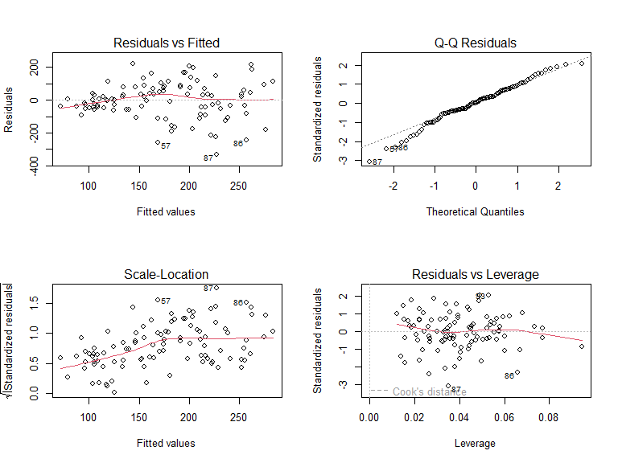

Analisis Regresi Linier dengan OLS
================
Analisis oleh Ferdian Bangkit Wijaya,
2 September 2025.

## Pendahuluan

Dokumen ini menyajikan analisis regresi linier berganda menggunakan
metode Ordinary Least Squares (OLS). Tujuannya adalah untuk memodelkan
hubungan antara variabel dependen y dengan variabel independen x1, x2,
dan x3.

## Memuat Paket dan Data

``` r
library(lmtest)
library(car)
library(nlme)
library(readxl)
```

## Mengimpor Data dari File Excel

``` r
# Ganti path file di bawah ini!
file_path <- "C:/Users/user/OneDrive - untirta.ac.id/R Script/Github_Regresi_OLS/data_simulasi_gls.xlsx"
data_OLS <- read_excel(file_path)
```

## Menampilkan Data yang diimport

``` r
knitr::kable(head(data_OLS), caption = "Pratinjau 6 Baris Pertama Data")
```

|        y |  x1 |       x2 |       x3 | time |
|---------:|----:|---------:|---------:|-----:|
| 44.24526 |   1 | 63.95721 | 53.70892 |    1 |
| 35.03337 |   2 | 48.54569 | 37.71991 |    2 |
| 47.91869 |   3 | 50.85295 | 48.37802 |    3 |
| 59.39113 |   4 | 49.90594 | 60.88072 |    4 |
| 45.62189 |   5 | 66.81707 | 53.59201 |    5 |
| 76.92317 |   6 | 50.25513 | 60.67191 |    6 |

Pratinjau 6 Baris Pertama Data

## Pemodelan OLS dan Ringkasan Model

``` r
model_ols <- lm(y ~ x1 + x2 + x3, data = data_OLS)
summary(model_ols)
```

    ## 
    ## Call:
    ## lm(formula = y ~ x1 + x2 + x3, data = data_OLS)
    ## 
    ## Residuals:
    ##     Min      1Q  Median      3Q     Max 
    ## -331.73  -52.72    3.07   72.89  220.79 
    ## 
    ## Coefficients:
    ##             Estimate Std. Error t value Pr(>|t|)    
    ## (Intercept)   0.8581    70.5060   0.012    0.990    
    ## x1            1.8305     0.3819   4.793    6e-06 ***
    ## x2            0.4335     0.6377   0.680    0.498    
    ## x3            1.2326     1.1471   1.075    0.285    
    ## ---
    ## Signif. codes:  0 '***' 0.001 '**' 0.01 '*' 0.05 '.' 0.1 ' ' 1
    ## 
    ## Residual standard error: 109.8 on 96 degrees of freedom
    ## Multiple R-squared:  0.1986, Adjusted R-squared:  0.1735 
    ## F-statistic: 7.929 on 3 and 96 DF,  p-value: 8.86e-05

## Uji Asumsi Klasik (Diagnostik Sisaan)

``` r
par(mfrow = c(2, 2))
plot(model_ols)
```

<!-- -->

``` r
par(mfrow = c(1, 1))
```

Uji Normalitas (Shapiro-Wilk)

Tujuan: Menguji apakah sisaan model berdistribusi normal.

Hipotesis:

H_0: Sisaan berdistribusi normal.

H_1: Sisaan tidak berdistribusi normal.

Kriteria Keputusan: Tolak H_0 jika p-value \< 0.05. Asumsi normalitas
terpenuhi jika kita gagal menolak H_0 (p-value \> 0.05).

``` r
print(shapiro.test(residuals(model_ols)))
```

    ## 
    ##  Shapiro-Wilk normality test
    ## 
    ## data:  residuals(model_ols)
    ## W = 0.98311, p-value = 0.2304

Uji Homoskedastisitas (Breusch-Pagan)

Tujuan: Menguji apakah varians dari sisaan konstan (homoskedastisitas)
atau tidak (heteroskedastisitas).

Hipotesis:

H_0: Varians sisaan konstan (homoskedastisitas).

H_1: Varians sisaan tidak konstan (terdapat heteroskedastisitas).

Kriteria Keputusan: Tolak H_0 jika p-value \< 0.05. Asumsi
homoskedastisitas terpenuhi jika kita gagal menolak H_0 (p-value \>
0.05).

``` r
print(bptest(model_ols))
```

    ## 
    ##  studentized Breusch-Pagan test
    ## 
    ## data:  model_ols
    ## BP = 20.185, df = 3, p-value = 0.0001554

Uji Autokorelasi (Durbin-Watson)

Tujuan: Menguji apakah ada korelasi antar sisaan pada observasi yang
berdekatan. Autokorelasi umumnya menjadi masalah pada data deret waktu
(time series).

Hipotesis:

H_0: Tidak ada autokorelasi (koefisien autokorelasi = 0).

H_1: Terdapat autokorelasi.

Kriteria Keputusan: Tolak H_0 jika p-value \< 0.05. Asumsi independensi
sisaan terpenuhi jika kita gagal menolak H_0 (p-value \> 0.05).

``` r
print(dwtest(model_ols))
```

    ## 
    ##  Durbin-Watson test
    ## 
    ## data:  model_ols
    ## DW = 0.74077, p-value = 5.116e-11
    ## alternative hypothesis: true autocorrelation is greater than 0

Uji Multikolinearitas (VIF)

Tujuan: Mendeteksi adanya korelasi yang tinggi antar variabel
independen.

Hipotesis: Uji VIF tidak menggunakan hipotesis H_0/H_1 dan p-value.

Kriteria Keputusan: Menggunakan aturan praktis (rule of thumb). Nilai
Variance Inflation Factor (VIF) \> 5 atau 10 mengindikasikan adanya
masalah multikolinearitas.

Harapan: Nilai VIF untuk setiap variabel independen di bawah 5.

``` r
print(vif(model_ols))
```

    ##       x1       x2       x3 
    ## 1.007994 1.002954 1.010958

## Evaluasi Kebaikan Model (Goodness-of-Fit)

``` r
r_squared <- summary(model_ols)$r.squared
adj_r_squared <- summary(model_ols)$adj.r.squared
model_aic <- AIC(model_ols)
model_bic <- BIC(model_ols)

evaluasi <- data.frame(
  Metrik = c("R-squared", "Adjusted R-squared", "AIC", "BIC"),
  Nilai = c(r_squared, adj_r_squared, model_aic, model_bic)
)

knitr::kable(evaluasi, caption = "Metrik Kebaikan Model (Goodness-of-Fit)")
```

| Metrik             |        Nilai |
|:-------------------|-------------:|
| R-squared          |    0.1985862 |
| Adjusted R-squared |    0.1735420 |
| AIC                | 1229.4573961 |
| BIC                | 1242.4832470 |

Metrik Kebaikan Model (Goodness-of-Fit)
